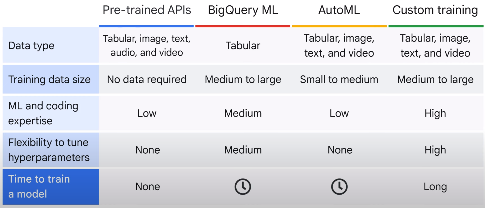
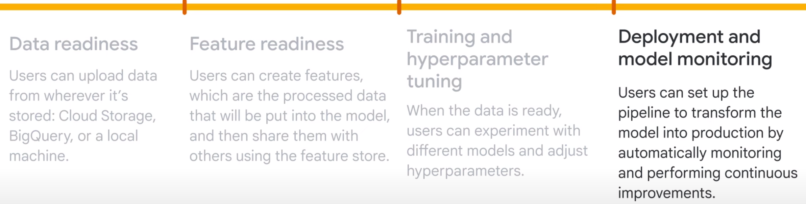

# Keywords
1. data preparation
2. model training
3. model serving with your own training data
4. custome training
5. Turn parameters
6. traing data -> ML algorithm -> ML Model

## Introduction
- options available to build an ML model
- AI development options :
    - pre-made
    - to low-code
    - no-code
    - do-it-yourself approach
    - pre-trained APIs, which are ready-made solutions using pre-trained machine learning models that don’t require any training data.

- explore AutoML on Vertex AI, which is a low- or no-code option for automating machine learning development, 
    from data preparation to model training and model serving with your own training data

- custom training, which is a solution that lets you manually code ML projects with tools like Python and TensorFlow.

- Natural Language API to identify subjects and analyze sentiment in text.

## GCP AI developement options
1. **preconfigured** solutions such as *pre-trained APIs*
    - use pre-trained machine learning models, so you don’t need to build your own if you don’t have training data or machine learning expertise in-house.

2. **low** solutions such as *BigQuery ML*
    - uses SQL queries to create and execute machine learning models in BigQuery.

3. **no-code** solutions such as *AutoML*
    - build your own machine learning models on Vertex AI through a point-and-click interface.

4. completely **DIY** approach with a code-based solution by using *custom training*.
    - you can code your very own machine learning environment, training, and deployment.

## Pre-trained APIs
- **Cloud Natural Language** API recognizes parts of speech called entities and sentiment
- **Speech-to-Text** API converts audio to text for data processing.
- **Cloud Translation** API converts text from one language to another.
- **Vision** API works with and recognizes content in static images.
- **Video Intelligence** API recognizes motion and action in video.
- **Dialogflow** API builds conversational interfaces.

- generative AI APIs, allow you to use different foundation models to generate various types of content:
    - **PaLM for text** : PaLM is Google’s pre-trained large language model.The PaLM API allows you perform language tasks and tune the LLM model with your own data.
    - **PaLM for chat** enables you to create applications that engage users in dynamic and context-aware conversations.
    - **Imagen** for Image lets you create and edit images.
    - **Embeddings API** for Text and Image allows you to extract semantic information from unstructured data.
    - **Chirp for speech** lets you build voice enabled applications
    - **Codey** for code generation helps you produce and debug code.
    
- NLP : four types of analysis: 
    - entity :  identifies the subjects in the text including: A proper noun, such as the name of a particular person, place, organization, or thing
        - How can entity analysis be applied to solve your business problems?
            - automatic tagging, auto-tag the main words of each document.
            - document classification, classify your documents to different categories based on key information in the text.
    
    - sentiment : used to identify the emotions indicated in the text such as positive, negative, and neutral
        - analyze the emotion of customer feedback, social network comments, and conversations

    - syntax
        - analyze syntax and extract linguistics information for further language model training in a specific field.

    - category
        - analysis for the entire text. For example, this text is about an Internet and telecom company.

## Vertex AI

## AutoML

## Custom training

