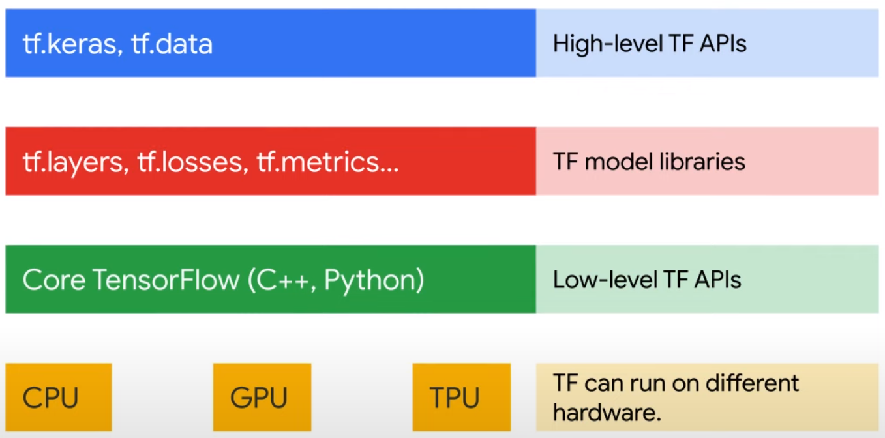

# ML Options
- part

# Keywords
1. data preparation
2. model training
3. model serving with your own training data
4. custome training
5. Turn parameters
6. traing data -> ML algorithm -> ML Model
7. pre-trained
8. fine-tuned
9. feature engineering
10. architecture search
11. hyperparameter tuning
12. model ensembly


## Introduction
- options available to build an ML model
- AI development options :
    - pre-made
    - to low-code
    - no-code
    - do-it-yourself approach
    - pre-trained APIs, which are ready-made solutions using pre-trained machine learning models that don’t require any training data.

- explore AutoML on Vertex AI, which is a low- or no-code option for automating machine learning development, 
    from data preparation to model training and model serving with your own training data

- custom training, which is a solution that lets you manually code ML projects with tools like Python and TensorFlow.

- Natural Language API to identify subjects and analyze sentiment in text.


## GCP AI developement options
1. **preconfigured** solutions such as *pre-trained APIs*
    - use pre-trained machine learning models, so you don’t need to build your own if you don’t have training data or machine learning expertise in-house.

2. **low** solutions such as *BigQuery ML*
    - uses SQL queries to create and execute machine learning models in BigQuery.

3. **no-code** solutions such as *AutoML*
    - build your own machine learning models on Vertex AI through a point-and-click interface.

4. completely **DIY** approach with a code-based solution by using *custom training*.
    - you can code your very own machine learning environment, training, and deployment.


## Pre-trained APIs
- **Cloud Natural Language** API recognizes parts of speech called entities and sentiment
- **Speech-to-Text** API converts audio to text for data processing.
- **Cloud Translation** API converts text from one language to another.
- **Vision** API works with and recognizes content in static images.
- **Video Intelligence** API recognizes motion and action in video.
- **Dialogflow** API builds conversational interfaces.

- generative AI APIs, allow you to use different foundation models to generate various types of content:
    - **PaLM for text** : PaLM is Google’s pre-trained large language model.The PaLM API allows you perform language tasks and tune the LLM model with your own data.
    - **PaLM for chat** enables you to create applications that engage users in dynamic and context-aware conversations.
    - **Imagen** for Image lets you create and edit images.
    - **Embeddings API** for Text and Image allows you to extract semantic information from unstructured data.
    - **Chirp for speech** lets you build voice enabled applications
    - **Codey** for code generation helps you produce and debug code.
    
- NLP : four types of analysis: 
    - entity :  identifies the subjects in the text including: A proper noun, such as the name of a particular person, place, organization, or thing
        - How can entity analysis be applied to solve your business problems?
            - automatic tagging, auto-tag the main words of each document.
            - document classification, classify your documents to different categories based on key information in the text.
    
    - sentiment : used to identify the emotions indicated in the text such as positive, negative, and neutral
        - analyze the emotion of customer feedback, social network comments, and conversations

    - syntax
        - analyze syntax and extract linguistics information for further language model training in a specific field.

    - category
        - analysis for the entire text. For example, this text is about an Internet and telecom company.


## Vertex AI


## AutoML


- phase (1) data processing.
    - After you upload a dataset, AutoML provides functions to automate part of the data preparation process. For example, automated **features engineering** like :
        - Numbers: generate quantilies, log, z_secore transforms
        - datatime extarctiin
        - categories : use one-hot encoding, grouping, embeddings
        - text : Tokenize, geenate n-grams, create embeddings

- phase (2) searching the best models architecute and tuning the parameters
    - Two critical technologies support this auto search :
        - **neural architect search** : which helps search the best models and tune the parameters automatically
            - The goal of neural architecture search is to find optimal models among many options.
            - Tries different architectures and models, and compares against the performance between models to find the best ones

        - **transfer learning** : which helps speed the searching by using the pre-trained models.
            - Machine learning is similar to human learning. It learns new things based on existing knowledge. 
                AutoML has already trained many different models with large amounts of data.These trained models 
                can be used as a foundation model to solve new problems with new data.
            - A typical example are **large language models (LLM)**, which are general purpose, and can be **pre-trained** and **fine-tuned** for specific purposes
            - LLMs are trained for general purposes to solve common language problems such as **text classification**, **question answering**, **document summarization**, and **text generation** across industries.
                - The models can then be tailored to solve specific problems in different fields such as retail, finance, and entertainment, *using a relatively small size of field datasets.*
            - Transfer learning is a powerful technique that lets people with smaller datasets or less computational power achieve great results by ***using pre-trained models trained on similar, larger datasets***. why ? because model doesn not need to learn from the begining.

- phase (3) Bagging ensemble
    - the best models are assembled from phase 2 and prepared for prediction in phase 4
    The assembly can be as simple as averaging the predictions of the top number of models
    Relying on multiple top models instead of one greatly improves the accuracy of prediction.


## Custom training
- There are two options: a pre-built container or a custom container.

- Tensorflow contains multiple abstraction layers, use TensorFlow APIs to develop and train ML models. 

- The TensorFlow APIs are arranged hierarchically, with the high-level APIs built on the low-level APIs.
    - The lowest layer is hardware. TensorFlow can run on different hardware platforms including CPU, GPU, and TPU.
    - The next layer is the low-level TensorFlow APIs, where you can write your own operations in C++ and call the core, basic, and numeric processing functions written in Python.
    - The third layer is the TensorFlow model libraries, which provide the building blocks such as neural network layers and evaluation metrics to create a custom ML model.
        - The high-level TensorFlow APIs like Keras sits on top of this hierarchy.They hide the ML building details and automatically deploy the training. They can be your most used APIs.





#### - Example of using tf.keras, a high-level TensorFlow library commonly used, to build a simple **regression model**
Typically, it takes three fundamental steps
- In step one, you *create a mode*l*, where you *piece together (create) the layers of a neural network*
    - for example, you can define your model as a three-layer neural network
        ```python
        model = tf.keras.models.Sequential([
        tf.keras.layers.Dense(2, activation='relu'),
        tf.keras.layers.Dense(3, activation='relu'),
        tf.keras.layers.Dense(4)
        ])
        ```

- In step two you *compile the model*, where you *specify (config) hyperparameters* such as **performance evaluation** and **model optimization**
    - compile the model by specifying how you want to train it by using the method compile
        - For instance, you can decide how to measure the performance by specifying a loss function.
        - You can also optimize the training by pointing to an optimizer.
        ```python
        model.compile(optimizer=tf.keras.optimizer.SGD(),
                    loss=tf.keras.layers,
                    metrics=['mae'])
        ```
- In step three you *fit a the model*, train your model to find the best *fit*.
    - For instance, you can define the input, the training data, and the output, the predicted results.
        - You can also decide how many iterations you want to train the model by specifying the numbers of epochs
        ```python
        model.fit(x_train, y_train, epochs=5)
        ```


## Lab
```bash
curl "https://language.googleapis.com/v1/documents:analyzeEntities?key=${API_KEY}" \
  -s -X POST -H "Content-Type: application/json" --data-binary @request.json > result.json
```


- Salience is a number in the [0,1] range that refers to the centrality of the entity to the text as a whole.
- Notice that you get two types of sentiment values: sentiment for the document as a whole, and sentiment broken down by sentence. The sentiment method returns two values:
- score - is a number from -1.0 to 1.0 indicating how positive or negative the statement is.
- magnitude - is a number ranging from 0 to infinity that represents the weight of sentiment expressed in the statement, regardless of being positive or negative.


- Sentiment analysis with the Natural Language API
```bash
curl "https://language.googleapis.com/v1/documents:analyzeSentiment?key=${API_KEY}" \
  -s -X POST -H "Content-Type: application/json" --data-binary @request.json
```


- Analyzing entity sentiment
```bash
curl "https://language.googleapis.com/v1/documents:analyzeEntitySentiment?key=${API_KEY}" \
  -s -X POST -H "Content-Type: application/json" --data-binary @request.json
```

```json
{
  "entities": [
    {
      "name": "sushi",
      "type": "CONSUMER_GOOD",
      "metadata": {},
      "salience": 0.51064336,
      "mentions": [
        {
          "text": {
            "content": "sushi",
            "beginOffset": 12
          },
          "type": "COMMON",
          "sentiment": {
            "magnitude": 0,
            "score": 0
          }
        }
      ],
      "sentiment": {
        "magnitude": 0,
        "score": 0
      }
    },
    {
      "name": "service",
      "type": "OTHER",
      "metadata": {},
      "salience": 0.48935664,
      "mentions": [
        {
          "text": {
            "content": "service",
            "beginOffset": 26
          },
          "type": "COMMON",
          "sentiment": {
            "magnitude": 0.7,
            "score": -0.7
          }
        }
      ],
      "sentiment": {
        "magnitude": 0.7,
        "score": -0.7
      }
    }
  ],
  "language": "en"
}
```


- Analyzing syntax and parts of speech "syntactic analysis"
```bash
curl "https://language.googleapis.com/v1/documents:analyzeSyntax?key=${API_KEY}" \
  -s -X POST -H "Content-Type: application/json" --data-binary @request.json
```

