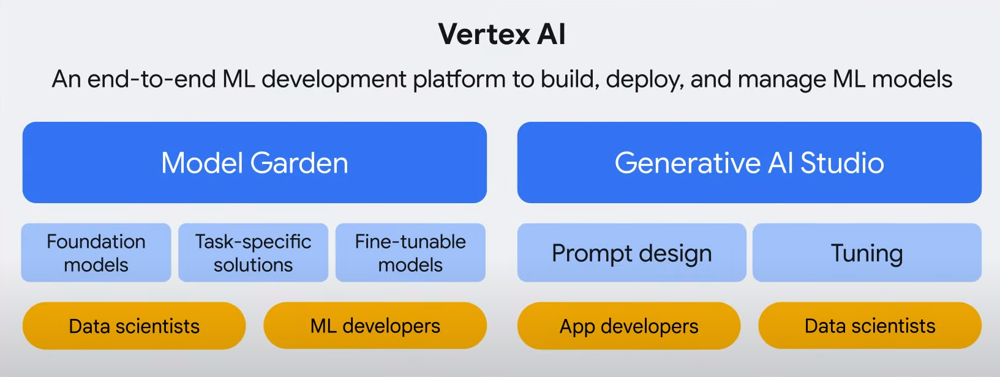
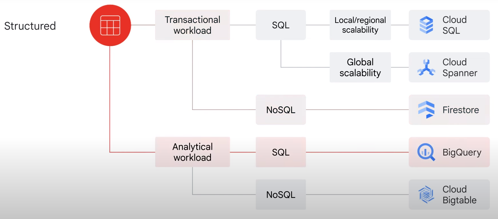
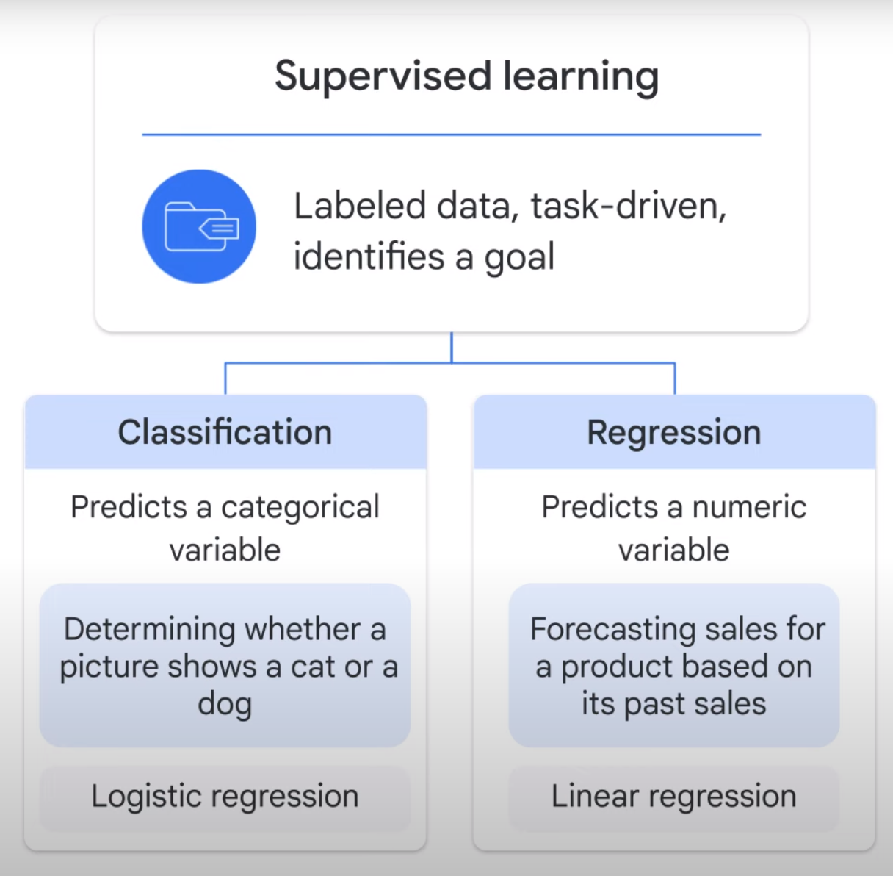
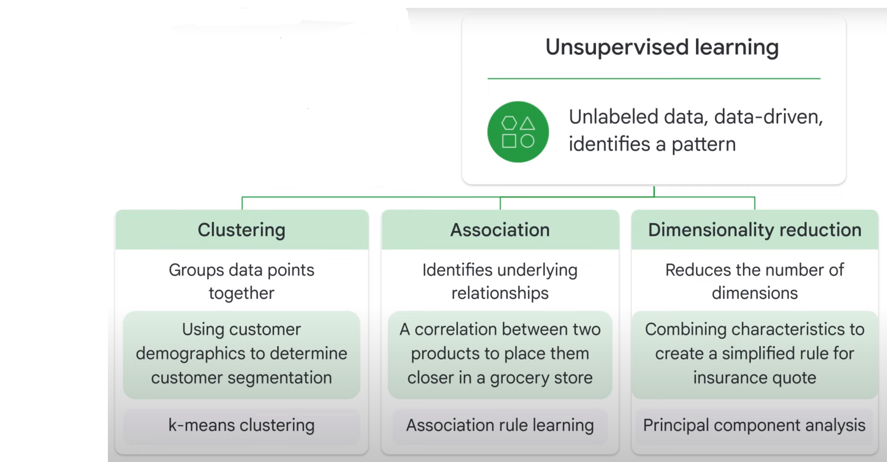
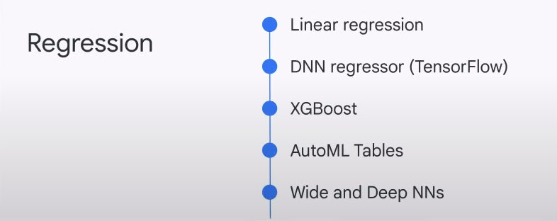
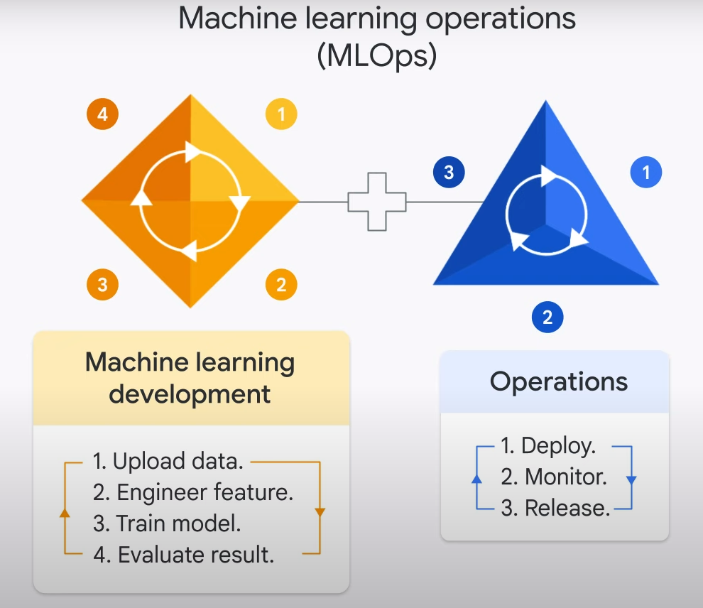
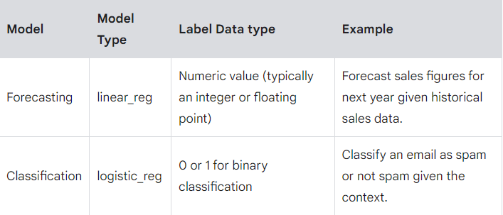

# Why Google ?

## tech and frameworks
TensorFlow : an open-source ML platform focusing on training deep learning neural networks, was developed by Google in 2015 

The transformer : the basis of all generative AI applications seen today, was invented by Google in 2017.

large language models evolved rapidly including :
- BERT : Bidirectional Encoder Representations from Transformers in 2018
- LaMDA : Language Model for Dialogue Applications in 2021
- PaLM : Pathways Language Model in 2022.

AI products :
- AutoML in 2018
- Al Platform in 2019
- Vertex AI in 2021
- Generative AI Studio and Model Garden added to Vertex AI in 2023

## Google responsibl AI - 7 principles
1. AI should be socially beneficial.
2. AI should avoid creating or reinforcing unfair bias.
3. AI should be built and tested for safety.
4. AI should be accountable to people.
5. AI should incorporate privacy design principles.
6. AI should uphold high standards of scientific excellence.
7. AI should be made available for uses that accord with these principles.


## Keywords :
- ML models
- Model development
- MLOps


# Ai/ML framework on Google Cloud
- data scientist : developm ML model from end to end
- ML engineer : build pipeline to monitro ML model performance
- AL/ML developer : would like to leverage generative AI capabilities in an application
- From data to AI

## AI/ML framwwork, toolbox, on Google Cloud :
Think of it in term of layers from bottom to top :
- AI Foundation (Cloud esstianls, data tools)
- AI Development
    - ML options : pr-trained API, BQ ML, AutoML, Custom training
    - ML workflow : workflow to build an ML model using Vertex AI, the end-to-end AI development platform, from **data preparation**, to **model training**, 
        and finally **model serving**.
        - automate ML workflow using the Vertex AI Pipelines SDK.
- Generative AI
    - how it works
        - **Foundationl model**
        - train with new datasets and generate **find-tuned models**
    - Tools to develop generative AI projects.
    
    - how generative AI empowers AI solutions
    


# Google Cloud infrastructure
base layer is networking and security,
next layer sit compute and storage
The top layer includes data and AI/machine learning products

TPU : Domaiin-specific hardware, tailoring the architecture to meet the computation needs in a domainFor example, "the matrix multiplication in machine learning"

### Compute
Compute engine, GKE, App Engine (PaaS), Cloud Function (FaaS, execute code in response to event), Cloud Run
### Storage
Cloud Storage, Cloud Bigtable, Cloud SQL, Cloud Spanner, Firestore and BigQuery

- You choose storage service/products based on data type and business need
Unstructured data is information stored in a non-tabular form such as documents, images, and audio files.
Unstructured data is usually suited to Cloud Storage.
BigQuery now offers the capability to store unstructured data as well.

#### Cloud storage classes
- Standard storage - hot data
- nearline storage - storing infrequently accessed data, like reading or modifying data once per month or less, on average
- coldline storage - read or modfy data at most once every 90 days
- archive storage - the lowest-cost option, used ideally for data archiving, online backup, and disaster recovery.the best choice for data that you plan to access less than once a year

structured data, which represents information stored in tables, rows, and columns.
Structured data comes in two types: transactional workloads and analytical workloads.
fast data inserts and updates are required to build row-based records.
Transactional workloads stem from online transaction processing systems, which are used when fast data inserts and updates are required to build row-based records.
06:49
This is usually to maintain a system snapshot.
They require relatively standardized queries that impact only a few records.

Then there are analytical workloads, which stem from online analytical processing systems, which are used when entire datasets need to be read.
07:06
They often require complex queries

Once you’ve determined if the workloads are transactional or analytical, you then need to identify whether the data will be accessed using SQL or not.

used when entire datasets need to be read
They often require complex queries, for example, aggregations
structured


Cloud Bigtable provides a scalable NoSQL solution for analytical workloads.
It’s best for real-time, high-throughput applications that require only millisecond latency.


# Data and AI products
### Data-To-AI Workflow


The major product to support AI development is Vertex
02:56
AI which is a unified platform and includes multiple tools such as AutoML, Vertex AI Workbench, Colab, Generative AI Studio, and Model Garden


## ML model categories

## artificial intelligence vs machine learning
- **AI** : is an umbrella term that includes anything related to computers mimicking human intelligence. For example, robots and self-driving cars
- **ML** : is a subset of artificial intelligence (AI) that allows computers to learn without being explicitly programmed.This is in contrast to traditional programming, where the computer is told explicitly what to do
    - Machine learning mainly includes **supervised** and **unsupervised** learning
    - **Deep learning/(deep neural networks)** : subset of machine learning that adds layers in between input data and output results to make a machine learn at more depth

## supervised vs unsupervised learning
- Imagine two types of problems: 
    - In problem one you are asked to **classify** dogs and cats from a very large set of pictures.

        You already know the difference between dogs and cats.

        So you **label** each picture and pass the labeled pictures to a machine.

        By learning from the data, in this case, pictures, with the answers, or labels, supervised learning is being

        enacted, allowing the machine to tell if a new picture represents a dog or cat in the future.

    - In problem two you are asked to classify breeds of dogs.

        Unfortunately this time you don’t know many of them and are not able to label the pictures.
        So you send these unlabeled pictures to a machine
        In this case, the **machine learns from the data without the answers/lables** and finds underlying **patterns** to group the animals.
        This is an example of unsupervised learning


- Put simply
    - **Supervised learning** deals with labeled data, is task-driven, and identifies a **goal**. **Unsupervised learning**, however, deals with unlabeled data, is data-driven, and identifies a **pattern**.
    - An easy way to distinguish between the two is that supervised learning provides each data point with a label, or an answer, while unsupervised does not.

### two major types of supervised learning: 
- Classification, which predicts a categorical ***variable***, such as determining whether a picture shows a cat or a dog.
    - In ML, you use models like a **logistic regression model** to solve classification problems.

- Regression, which predicts a numeric variable, like forecasting sales for a product based on its past sales.
    - In ML, you use models like a **linear regression model** to solve regression problems.




### three major types of unsupervised learning:
- clustering, which groups together data points with similar characteristics and assigns them to "clusters," like using customer demographics to determine customer segmentation.
    - You use ML models like k-means clustering to solve clustering problems.

- association, which identifies underlying relationships, like a correlation between two products to place them closer together in a grocery store for a promotion.
    - You use association rule learning techniques and algorithms like Apriori to solve association problems.

- dimensionality reduction, which reduces the number of **dimensions**, or **features**, in a dataset to improve the *efficiency of a model*.
    - For example, combining customer characteristics like age, driving violation history, or car type, to create a simplified rule for calculating an insurance quote.
    - You use ML techniques like principal component analysis to solve these problems.




## Test examples 

### predict customer spending based on purchase history.
- **supervised learning** because you have the labeled data, the amount the customers have spent, and you want to predict their future purchases
- **regression** problem because it predicts a continuous number: future spending.
- **linear regression model** is for regression problems.

### Imagine you are using the same dataset; however, this time you are asked to identify customer segmentation.
- **unsupervised learning** because you don’t have each customer labeled as belonging to a certain segment. Instead, you want the computer to discover the underlying pattern
- **clustering** problem because identifying customer segmentation/*cluster*
- **k-means clustering model** it’s a clustering analysis scenario


## BigQuery ML
Building and training ML models can be very time-intensive
   - import and prepare 
   - experiment with different ML models and tune the parameters
   - train the model with new data and features To improve the model performance
   - deploy the model to make predictions

This is an iterative process that requires a lot of time and resources.


**BigQuery ML** tunes the parameters for you and helps you manage the ML workflow.

**phases of a machine learning project and the key SQL commands**

- In phase 1, you extract, transform, and load data into BigQuery, if it isn’t there already.

- In phase 2, you select and preprocess features. 
    You can use SQL to create the **training dataset** for the model to learn from. 
    BigQuery ML does some of the preprocessing for you, like one-hot encoding of your categorical variables.
    *One-hot encoding converts your categorical data into numeric data that is required by a training model.*

- In phase 3, you create the model inside BigQuery. This is done by using the 'CREATE MODEL' command.
    For exmaple, you want to create a ML model to predict customer purchasing behavior, specifically if they will buy this product in the future.
    - You give the model a name: *ecommerce.classification*
    - You then specify the model type: *model_type: logistic_reg*

    - BigQuery ML also supports many popular ML models :

        

        

        


    - BigQuery ML supports MLOps : **MLOps** turns your ML experiment to production and helps deploy, monitor, and manage the ML models
        - Import tenserFlow models for batch prediction
        - Export models from BigQuery ML for online prediction
        - Hyperparameter tuning using Vertex AI Vizier

            

- In phase 4, after your model is trained, you evaluate the performance of the trained model on your evaluation dataset. 'ML.EVALUATE'
    - Model evaluation metrics :
        - roc_auc
        - accuracy
        - precision
        - recall

- in phase 5, when you’re happy with your model performance, you can then use it to make predictions.'ML.PREDICT' command on your newly trained model.


## Lab
1. Loading data into BigQuery from a public dataset Querying
2. exploring the ecommerce dataset
3. Creating a training and evaluation dataset to be used for batch prediction
4. Creating a classification (logistic regression) model in BQML
5. Evaluating the performance of your machine learning model
6. predicting and ranking the probability that a visitor will make a purchase

## Predicting Visitor Purchases with BigQuery ML

### Task 1. Explore ecommerce data
Question: Out of the total visitors who visited our website, what % made a purchase?

```
#standardSQL
WITH visitors AS(
SELECT
COUNT(DISTINCT fullVisitorId) AS total_visitors
FROM `data-to-insights.ecommerce.web_analytics`
),

purchasers AS(
SELECT
COUNT(DISTINCT fullVisitorId) AS total_purchasers
FROM `data-to-insights.ecommerce.web_analytics`
WHERE totals.transactions IS NOT NULL
)

SELECT
  total_visitors,
  total_purchasers,
  total_purchasers / total_visitors AS conversion_rate
FROM visitors, purchasers
```


Question: What are the top 5 selling products?

```
SELECT
  p.v2ProductName,
  p.v2ProductCategory,
  SUM(p.productQuantity) AS units_sold,
  ROUND(SUM(p.localProductRevenue/1000000),2) AS revenue
FROM `data-to-insights.ecommerce.web_analytics`,
UNNEST(hits) AS h,
UNNEST(h.product) AS p
GROUP BY 1, 2
ORDER BY revenue DESC
LIMIT 5;
```


Question: How many visitors bought on subsequent visits to the website?

```
# visitors who bought on a return visit (could have bought on first as well
WITH all_visitor_stats AS (
SELECT
  fullvisitorid, # 741,721 unique visitors
  IF(COUNTIF(totals.transactions > 0 AND totals.newVisits IS NULL) > 0, 1, 0) AS will_buy_on_return_visit
  FROM `data-to-insights.ecommerce.web_analytics`
  GROUP BY fullvisitorid
)

SELECT
  COUNT(DISTINCT fullvisitorid) AS total_visitors,
  will_buy_on_return_visit
FROM all_visitor_stats
GROUP BY will_buy_on_return_visit
```

Analyzing the results, you can see that (11873 / 729848) = 1.6% of total visitors will return and purchase from the website. This includes the subset of visitors who bought on their very first session and then came back and bought again


This behavior is very common for luxury goods where significant up-front research and comparison is required by the customer before deciding (think car purchases) but also true to a lesser extent for the merchandise on this site (t-shirts, accessories, etc).

In the world of online marketing, identifying and marketing to these future customers based on the characteristics of their first visit will increase conversion rates and reduce the outflow to competitor sites.


## Task 2. Select features and create your training dataset
- Now you will create a Machine Learning model in BigQuery to predict whether or not a new user is likely to purchase in the future
- find useful features that will help a machine learning model understand the relationship between data about a visitor's first time on your website and whether they will return and make a purchase.


- Your team decides to test whether these two fields are good inputs for your classification model:

    - totals.bounces (whether the visitor left the website immediately)
    - totals.timeOnSite (how long the visitor was on our website)

    - What are the risks of only using the above two fields?
        Whether a user bounces is highly correlated with their time on site (e.g. 0 seconds).
        Only using time spent on the site ignores other potential useful columns (features).


- Machine learning is only as good as the training data that is fed into it. 
    If there isn't enough information for the model to determine and learn the relationship between your input features and your label (in this case, whether the visitor bought in the future) then you will not have an accurate model

- While training a model on just these two fields is a start, you will see if they're good enough to produce an accurate model.


```
SELECT
  * EXCEPT(fullVisitorId)
FROM

  # features
  (SELECT
    fullVisitorId,
    IFNULL(totals.bounces, 0) AS bounces,
    IFNULL(totals.timeOnSite, 0) AS time_on_site
  FROM
    `data-to-insights.ecommerce.web_analytics`
  WHERE
    totals.newVisits = 1)
  JOIN
  (SELECT
    fullvisitorid,
    IF(COUNTIF(totals.transactions > 0 AND totals.newVisits IS NULL) > 0, 1, 0) AS will_buy_on_return_visit
  FROM
      `data-to-insights.ecommerce.web_analytics`
  GROUP BY fullvisitorid)
  USING (fullVisitorId)
ORDER BY time_on_site DESC
LIMIT 10;
```


Which fields are the model features? What is the label (correct answer)?
    The features are bounces and time_on_site. The label is will_buy_on_return_visit (right)
    The features are bounces and will_buy_on_return_visit. The label is time_on_site (wrong)
    The feature is will_buy_on_return_visit. The labels are bounces and time_on_site (wrong)

Which fields are known after a visitor's first session? (Check all that apply) ?
    visitId - yes
    bounces - yes
    time_on_site - yes
    will_buy_on_return_visit - no

Which field isn't known until later in the future after their first session?
    will_buy_on_return_visit - yes

**Discussion:** 
will_buy_on_return_visit is not known after the first visit. Again, you're predicting for a subset of users who returned to your website and purchased. Since you don't know the future at prediction time, you cannot say with certainty whether a new visitor comes back and purchases. The value of building a ML model is to get the **probability** of future purchase based on the data gleaned about their first session.


Question: Looking at the initial data results, do you think time_on_site and bounces will be a good indicator of whether the user will return and purchase or not?

Answer: It's often too early to tell before training and evaluating the model, but at first glance out of the top 10 time_on_site, only 1 customer returned to buy, which isn't very promising. Let's see how well the model does.


## Task 3. Create a BigQuery dataset to store models


### Task 4. Select a BigQuery ML model type and specify options
Now that you have your initial features selected, you are now ready to create your first ML model in BigQuery.

There are the two model types to choose from:



**Note:** There are many additional model types used in Machine Learning (like Neural Networks and decision trees) and available using libraries like TensorFlow. At the time of writing, BigQuery ML supports the two listed above.

Forecasting model (like linear_reg etc.)

Classification model (like logistic_reg etc.)

Recommendation model (like matrix_factorization etc.)


```
CREATE OR REPLACE MODEL `ecommerce.classification_model`
OPTIONS
(
model_type='logistic_reg',
labels = ['will_buy_on_return_visit']
)
AS

#standardSQL
SELECT
  * EXCEPT(fullVisitorId)
FROM

  # features
  (SELECT
    fullVisitorId,
    IFNULL(totals.bounces, 0) AS bounces,
    IFNULL(totals.timeOnSite, 0) AS time_on_site
  FROM
    `data-to-insights.ecommerce.web_analytics`
  WHERE
    totals.newVisits = 1
    AND date BETWEEN '20160801' AND '20170430') # train on first 9 months
  JOIN
  (SELECT
    fullvisitorid,
    IF(COUNTIF(totals.transactions > 0 AND totals.newVisits IS NULL) > 0, 1, 0) AS will_buy_on_return_visit
  FROM
      `data-to-insights.ecommerce.web_analytics`
  GROUP BY fullvisitorid)
  USING (fullVisitorId)
;
```

Wait for the model to train (5 - 10 minutes).

Note: You cannot feed all of your available data to the model during training since you need to save some unseen data points for model evaluation and testing. To accomplish this, add a WHERE clause condition is being used to filter and train on only the first 9 months of session data in your 12 month dataset.

- Loss type
Mean log loss


## Task 5. Evaluate classification model performance

Select your performance criteria
For classification problems in ML, you want to minimize the False Positive Rate (predict that the user will return and purchase and they don't) and maximize the True Positive Rate (predict that the user will return and purchase and they do).

This relationship is visualized with a ROC (Receiver Operating Characteristic) curve like the one shown here, where you try to maximize the area under the curve or AUC:


```
SELECT
  roc_auc,
  CASE
    WHEN roc_auc > .9 THEN 'good'
    WHEN roc_auc > .8 THEN 'fair'
    WHEN roc_auc > .7 THEN 'not great'
  ELSE 'poor' END AS model_quality
FROM
  ML.EVALUATE(MODEL ecommerce.classification_model,  (

SELECT
  * EXCEPT(fullVisitorId)
FROM

  # features
  (SELECT
    fullVisitorId,
    IFNULL(totals.bounces, 0) AS bounces,
    IFNULL(totals.timeOnSite, 0) AS time_on_site
  FROM
    `data-to-insights.ecommerce.web_analytics`
  WHERE
    totals.newVisits = 1
    AND date BETWEEN '20170501' AND '20170630') # eval on 2 months
  JOIN
  (SELECT
    fullvisitorid,
    IF(COUNTIF(totals.transactions > 0 AND totals.newVisits IS NULL) > 0, 1, 0) AS will_buy_on_return_visit
  FROM
      `data-to-insights.ecommerce.web_analytics`
  GROUP BY fullvisitorid)
  USING (fullVisitorId)

));
```


After evaluating your model you get a roc_auc of 0.72, which shows that the model has not great predictive power. Since the goal is to get the area under the curve as close to 1.0 as possible, there is room for improvement.


## Task 6. Improve model performance with feature engineering

```
CREATE OR REPLACE MODEL `ecommerce.classification_model_2`
OPTIONS
  (model_type='logistic_reg', labels = ['will_buy_on_return_visit']) AS

WITH all_visitor_stats AS (
SELECT
  fullvisitorid,
  IF(COUNTIF(totals.transactions > 0 AND totals.newVisits IS NULL) > 0, 1, 0) AS will_buy_on_return_visit
  FROM `data-to-insights.ecommerce.web_analytics`
  GROUP BY fullvisitorid
)

# add in new features
SELECT * EXCEPT(unique_session_id) FROM (

  SELECT
      CONCAT(fullvisitorid, CAST(visitId AS STRING)) AS unique_session_id,

      # labels
      will_buy_on_return_visit,

      MAX(CAST(h.eCommerceAction.action_type AS INT64)) AS latest_ecommerce_progress,

      # behavior on the site
      IFNULL(totals.bounces, 0) AS bounces,
      IFNULL(totals.timeOnSite, 0) AS time_on_site,
      totals.pageviews,

      # where the visitor came from
      trafficSource.source,
      trafficSource.medium,
      channelGrouping,

      # mobile or desktop
      device.deviceCategory,

      # geographic
      IFNULL(geoNetwork.country, "") AS country

  FROM `data-to-insights.ecommerce.web_analytics`,
     UNNEST(hits) AS h

    JOIN all_visitor_stats USING(fullvisitorid)

  WHERE 1=1
    # only predict for new visits
    AND totals.newVisits = 1
    AND date BETWEEN '20160801' AND '20170430' # train 9 months

  GROUP BY
  unique_session_id,
  will_buy_on_return_visit,
  bounces,
  time_on_site,
  totals.pageviews,
  trafficSource.source,
  trafficSource.medium,
  channelGrouping,
  device.deviceCategory,
  country
);
```

Note: You are still training on the same first 9 months of data, even with this new model. It's important to have the same training dataset so you can be certain a better model output is attributable to better input features and not new or different training data.


A key new feature that was added to the training dataset query is the maximum checkout progress each visitor reached in their session, which is recorded in the field hits.eCommerceAction.action_type. If you search for that field in the field definitions you will see the field mapping of 6 = Completed Purchase.

As an aside, the web analytics dataset has nested and repeated fields like ARRAYS which need to be broken apart into separate rows in your dataset. This is accomplished by using the UNNEST() function, which you can see in the above query.


Evaluate this new model to see if there is better predictive power by running the below query:

```
#standardSQL
SELECT
  roc_auc,
  CASE
    WHEN roc_auc > .9 THEN 'good'
    WHEN roc_auc > .8 THEN 'fair'
    WHEN roc_auc > .7 THEN 'not great'
  ELSE 'poor' END AS model_quality
FROM
  ML.EVALUATE(MODEL ecommerce.classification_model_2,  (

WITH all_visitor_stats AS (
SELECT
  fullvisitorid,
  IF(COUNTIF(totals.transactions > 0 AND totals.newVisits IS NULL) > 0, 1, 0) AS will_buy_on_return_visit
  FROM `data-to-insights.ecommerce.web_analytics`
  GROUP BY fullvisitorid
)

# add in new features
SELECT * EXCEPT(unique_session_id) FROM (

  SELECT
      CONCAT(fullvisitorid, CAST(visitId AS STRING)) AS unique_session_id,

      # labels
      will_buy_on_return_visit,

      MAX(CAST(h.eCommerceAction.action_type AS INT64)) AS latest_ecommerce_progress,

      # behavior on the site
      IFNULL(totals.bounces, 0) AS bounces,
      IFNULL(totals.timeOnSite, 0) AS time_on_site,
      totals.pageviews,

      # where the visitor came from
      trafficSource.source,
      trafficSource.medium,
      channelGrouping,

      # mobile or desktop
      device.deviceCategory,

      # geographic
      IFNULL(geoNetwork.country, "") AS country

  FROM `data-to-insights.ecommerce.web_analytics`,
     UNNEST(hits) AS h

    JOIN all_visitor_stats USING(fullvisitorid)

  WHERE 1=1
    # only predict for new visits
    AND totals.newVisits = 1
    AND date BETWEEN '20170501' AND '20170630' # eval 2 months

  GROUP BY
  unique_session_id,
  will_buy_on_return_visit,
  bounces,
  time_on_site,
  totals.pageviews,
  trafficSource.source,
  trafficSource.medium,
  channelGrouping,
  device.deviceCategory,
  country
)
));
```


With this new model you now get a roc_auc of 0.91 which is significantly better than the first model.

Now that you have a trained model, time to make some predictions.


## Task 7. Predict which new visitors will come back and purchase

```
SELECT
*
FROM
  ml.PREDICT(MODEL `ecommerce.classification_model_2`,
   (

WITH all_visitor_stats AS (
SELECT
  fullvisitorid,
  IF(COUNTIF(totals.transactions > 0 AND totals.newVisits IS NULL) > 0, 1, 0) AS will_buy_on_return_visit
  FROM `data-to-insights.ecommerce.web_analytics`
  GROUP BY fullvisitorid
)

  SELECT
      CONCAT(fullvisitorid, '-',CAST(visitId AS STRING)) AS unique_session_id,

      # labels
      will_buy_on_return_visit,

      MAX(CAST(h.eCommerceAction.action_type AS INT64)) AS latest_ecommerce_progress,

      # behavior on the site
      IFNULL(totals.bounces, 0) AS bounces,
      IFNULL(totals.timeOnSite, 0) AS time_on_site,
      totals.pageviews,

      # where the visitor came from
      trafficSource.source,
      trafficSource.medium,
      channelGrouping,

      # mobile or desktop
      device.deviceCategory,

      # geographic
      IFNULL(geoNetwork.country, "") AS country

  FROM `data-to-insights.ecommerce.web_analytics`,
     UNNEST(hits) AS h

    JOIN all_visitor_stats USING(fullvisitorid)

  WHERE
    # only predict for new visits
    totals.newVisits = 1
    AND date BETWEEN '20170701' AND '20170801' # test 1 month

  GROUP BY
  unique_session_id,
  will_buy_on_return_visit,
  bounces,
  time_on_site,
  totals.pageviews,
  trafficSource.source,
  trafficSource.medium,
  channelGrouping,
  device.deviceCategory,
  country
)

)

ORDER BY
  predicted_will_buy_on_return_visit DESC;
```


The predictions are made in the last 1 month (out of 12 months) of the dataset.

Your model will now output the predictions it has for those July 2017 ecommerce sessions. You can see three newly added fields:

predicted_will_buy_on_return_visit: whether the model thinks the visitor will buy later (1 = yes)
predicted_will_buy_on_return_visit_probs.label: the binary classifier for yes / no
predicted_will_buy_on_return_visit_probs.prob: the confidence the model has in it's prediction (1 = 100%)


Results
Of the top 6% of first-time visitors (sorted in decreasing order of predicted probability), more than 6% make a purchase in a later visit.
These users represent nearly 50% of all first-time visitors who make a purchase in a later visit.
Overall, only 0.7% of first-time visitors make a purchase in a later visit.
Targeting the top 6% of first-time increases marketing ROI by 9x vs targeting them all!


roc_auc is just one of the performance metrics available during model evaluation. Also available are accuracy, precision, and recall. Knowing which performance metric to rely on is highly dependent on what your overall objective or goal is.


## Challenge
### Summary
In the previous two tasks you saw the power of feature engineering at work in improving our models performance. However, we still may be able to improve our performance by exploring other model types. For classification problems, BigQuery ML also supports the following model types:

Deep Neural Networks.
Boosted Decision Trees (XGBoost).
AutoML Tables Models.
Importing Custom TensorFlow Models.


### Task
Though our linear classification (logistic regression) model performed well after feature engineering, it may be too simple of a model to fully capture the relationship between the features and the label. Using the same dataset and labels as you did in Task 6 to create the model ecommerce.classification_model_2, your challenge is to create a XGBoost Classifier.

Note: Hint : Use following options for Boosted_Tree_Classifier:
1. L2_reg = 0.1
2. num_parallel_tree = 8
3. max_tree_depth = 10

### Solution:

```
CREATE OR REPLACE MODEL `ecommerce.classification_model_3`
        OPTIONS
          (model_type='BOOSTED_TREE_CLASSIFIER' , l2_reg = 0.1, num_parallel_tree = 8, max_tree_depth = 10,
              labels = ['will_buy_on_return_visit']) AS

        WITH all_visitor_stats AS (
        SELECT
          fullvisitorid,
          IF(COUNTIF(totals.transactions > 0 AND totals.newVisits IS NULL) > 0, 1, 0) AS will_buy_on_return_visit
          FROM `data-to-insights.ecommerce.web_analytics`
          GROUP BY fullvisitorid
        )

        # add in new features
        SELECT * EXCEPT(unique_session_id) FROM (

          SELECT
              CONCAT(fullvisitorid, CAST(visitId AS STRING)) AS unique_session_id,

              # labels
              will_buy_on_return_visit,

              MAX(CAST(h.eCommerceAction.action_type AS INT64)) AS latest_ecommerce_progress,

              # behavior on the site
              IFNULL(totals.bounces, 0) AS bounces,
              IFNULL(totals.timeOnSite, 0) AS time_on_site,
              totals.pageviews,

              # where the visitor came from
              trafficSource.source,
              trafficSource.medium,
              channelGrouping,

              # mobile or desktop
              device.deviceCategory,

              # geographic
              IFNULL(geoNetwork.country, "") AS country

          FROM `data-to-insights.ecommerce.web_analytics`,
             UNNEST(hits) AS h

            JOIN all_visitor_stats USING(fullvisitorid)

          WHERE 1=1
            # only predict for new visits
            AND totals.newVisits = 1
            AND date BETWEEN '20160801' AND '20170430' # train 9 months

          GROUP BY
          unique_session_id,
          will_buy_on_return_visit,
          bounces,
          time_on_site,
          totals.pageviews,
          trafficSource.source,
          trafficSource.medium,
          channelGrouping,
          device.deviceCategory,
          country
        );
```


Let us now evaluate our model and see how we did:

```
#standardSQL
SELECT
  roc_auc,
  CASE
    WHEN roc_auc > .9 THEN 'good'
    WHEN roc_auc > .8 THEN 'fair'
    WHEN roc_auc > .7 THEN 'not great'
  ELSE 'poor' END AS model_quality
FROM
  ML.EVALUATE(MODEL ecommerce.classification_model_3,  (

WITH all_visitor_stats AS (
SELECT
  fullvisitorid,
  IF(COUNTIF(totals.transactions > 0 AND totals.newVisits IS NULL) > 0, 1, 0) AS will_buy_on_return_visit
  FROM `data-to-insights.ecommerce.web_analytics`
  GROUP BY fullvisitorid
)

# add in new features
SELECT * EXCEPT(unique_session_id) FROM (

  SELECT
      CONCAT(fullvisitorid, CAST(visitId AS STRING)) AS unique_session_id,

      # labels
      will_buy_on_return_visit,

      MAX(CAST(h.eCommerceAction.action_type AS INT64)) AS latest_ecommerce_progress,

      # behavior on the site
      IFNULL(totals.bounces, 0) AS bounces,
      IFNULL(totals.timeOnSite, 0) AS time_on_site,
      totals.pageviews,

      # where the visitor came from
      trafficSource.source,
      trafficSource.medium,
      channelGrouping,

      # mobile or desktop
      device.deviceCategory,

      # geographic
      IFNULL(geoNetwork.country, "") AS country

  FROM `data-to-insights.ecommerce.web_analytics`,
     UNNEST(hits) AS h

    JOIN all_visitor_stats USING(fullvisitorid)

  WHERE 1=1
    # only predict for new visits
    AND totals.newVisits = 1
    AND date BETWEEN '20170501' AND '20170630' # eval 2 months

  GROUP BY
  unique_session_id,
  will_buy_on_return_visit,
  bounces,
  time_on_site,
  totals.pageviews,
  trafficSource.source,
  trafficSource.medium,
  channelGrouping,
  device.deviceCategory,
  country
)
));
```

Our roc_auc has increased by about .02 to around .94!


It’s a small change in the roc_auc, but note that since 1 is a perfect roc_auc, it gets more difficult to improve the metric the closer to 1 it gets.

This is a great example of how easy it is in BigQuery ML to try out different model types with different options to see how they perform. We were able to use a much more complex model type by only changing one line of SQL.

One may reasonably ask “Where did the choices for these options come from?”, and the answer is experimentation! When you are trying to find the best model type for your problems, then one has to experiment with different sets of options in a process known as hyperparameter tuning.

Let’s finish up by generating predictions with our improved model and see how they compare to those we generated before. By using a Boosted tree classifier model, you can observe a slight improvement of 0.2 in our ROC AUC compared to the previous model. The query below will predict which new visitors will come back and make a purchase:


```
SELECT
*
FROM
  ml.PREDICT(MODEL `ecommerce.classification_model_3`,
   (

WITH all_visitor_stats AS (
SELECT
  fullvisitorid,
  IF(COUNTIF(totals.transactions > 0 AND totals.newVisits IS NULL) > 0, 1, 0) AS will_buy_on_return_visit
  FROM `data-to-insights.ecommerce.web_analytics`
  GROUP BY fullvisitorid
)

  SELECT
      CONCAT(fullvisitorid, '-',CAST(visitId AS STRING)) AS unique_session_id,

      # labels
      will_buy_on_return_visit,

      MAX(CAST(h.eCommerceAction.action_type AS INT64)) AS latest_ecommerce_progress,

      # behavior on the site
      IFNULL(totals.bounces, 0) AS bounces,
      IFNULL(totals.timeOnSite, 0) AS time_on_site,
      totals.pageviews,

      # where the visitor came from
      trafficSource.source,
      trafficSource.medium,
      channelGrouping,

      # mobile or desktop
      device.deviceCategory,

      # geographic
      IFNULL(geoNetwork.country, "") AS country

  FROM `data-to-insights.ecommerce.web_analytics`,
     UNNEST(hits) AS h

    JOIN all_visitor_stats USING(fullvisitorid)

  WHERE
    # only predict for new visits
    totals.newVisits = 1
    AND date BETWEEN '20170701' AND '20170801' # test 1 month

  GROUP BY
  unique_session_id,
  will_buy_on_return_visit,
  bounces,
  time_on_site,
  totals.pageviews,
  trafficSource.source,
  trafficSource.medium,
  channelGrouping,
  device.deviceCategory,
  country
)

)

ORDER BY
  predicted_will_buy_on_return_visit DESC;
```

The output now shows a classification model that can better predict the probability that a first-time visitor to the Google Merchandise Store will make a purchase in a later visit. By comparing the result above with the previous model shown in Task 7, you can see the confidence the model has in its predictions is more accurate when compared to the logistic_regression model type.

