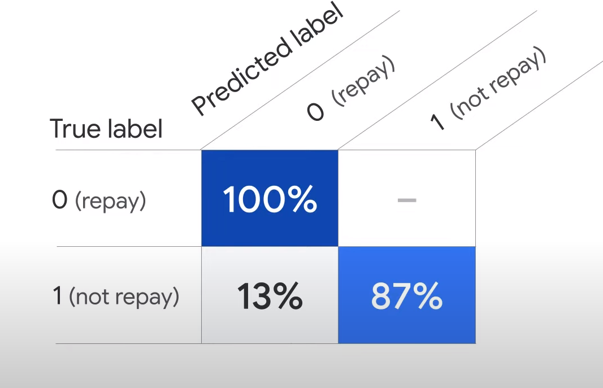

# ML Workflow
- part

## How a machine learns

## Lab
- 3 phases of ML workflows
    - data preparation, model development, and model serving.

- model evaluation - (help you to interpret the training results)

#### confusion matrix
- The true positives are 100%
    - This represents the percentage of people that the model predicts would repay their loan and actually paid it back.
    - In other words the model is 100% accurate in predicting the number of people that would pay back their loan.

- The true negatives are 87%
    - This represents the percentage of people that the model predicts would not repay their loan and indeed did not pay it back.
    - In other words the model is 87% accurate in predicting the number of people that would not pay back their loan.

- The false negatives are 0%.
    - This represents the percentage of people that the model predicts would not repay their loan but actually paid it back.

- the false positives are 13%
    - This representing the percentage of people that the model predicts would repay their loan but actually did not pay it back.

- As a general principle, it’s good to have high true positives and true negatives, and low false positives and false negatives.

- different ways to improve the performance of a model : 
    - using a more accurate data source
    - using a larger dataset
    - choosing a different type of ML model
    - tuning the hyperparameters.

#### precision-recall curve 

- **confidence threshold** determines how a machine learning model counts the positive cases
    - A higher threshold increases the precision but decreases recall.
    - A lower threshold decreases the precision, but increases recall.

- Scnario: Moving the confidence threshold to zero produces the highest recall of 100% and the lowest precision of 50%.
    - That means the model predicts that 100% of loan applicants will be able to repay a loan they take out.
        However, actually only 50% of people were able to repay the loan.
    - Using this threshold to identify the default cases in this example can be risky, 
        because it means that you can only get half of the loan investment back.

- scnario:  other extreme by moving the threshold to 1. This will produce the highest precision of 100% with the lowest recall of 1%.
    - It means that of all the people who were predicted to repay the loan, 100% of them actually did.
        However, you rejected 99% of loan applicants by only offering loans to 1% of them.
    - That’s a pretty big business loss for your company.

- **These are both extreme examples, but it’s important that you always try to set an appropriate threshold for your model.**

### Questions
- A hospital uses the machine learning technology of Google to help pre-diagnose cancer by feeding historical patient medical data to the model. 
    The goal is to identify as many potential cases as possible. Which metric should the model focus on?
    - Feature importance
    - Confusion matrix
    - Precision
    - Recall **correct**

- A farm uses the machine learning technology of Google to detect defective apples in their crop, like those with irregular sizes or scratches. The goal is to identify only the apples that are actually bad so that no good apples are wasted. Which metric should the model focus on?

    - Feature importance
    - Confusion matrix
    - Precision **correct**
    - Recall

## Lab 2
- Upload a dataset to Vertex AI.
- Train a machine learning model with AutoML.
- Evaluate the model performance.
- Deploy the model to an endpoint.
- Get predictions.-

#### Vertex AI provides many metrics to evaluate the model performance. You focus on three:

Precision/Recall curve
Confusion Matrix
Feature Importance

The confusion matrix
A confusion matrix tells you the percentage of examples from each class in your test set that your model predicted correctly.

The feature importance
In Vertex AI, feature importance is displayed through a bar chart to illustrate how each feature contributes to a prediction. The longer the bar, or the larger the numerical value associated with a feature, the more important it is.

gcloud storage cp gs://spls/cbl455/cbl455.tar.gz .

{"endpointId": "1411183591831896064", "instance": "[{age: 30.00, ClientID: '998', income: 50000.00, loan: 20000.00}]"}

{"model_class":"0","model_score":1.0322887E-5}

### 
Prompt design
You can feed your desired input text, e.g. a question, to the model. The model will then provide a response based on how you structured your prompt. The process of figuring out and designing the best input text (prompt) to get the desired response back from the model is called Prompt Design.

There is no best way to design the prompts yet. Generally, there are 3 methods that you can use to shape the model's response in a way that you desired.

Zero-shot prompting - This is a method where the LLM is given no additional data on the specific task that it is being asked to perform. Instead, it is only given a prompt that describes the task. For example, if you want the LLM to answer a question, you just prompt "what is prompt design?".
One-shot prompting - This is a method where the LLM is given a single example of the task that it is being asked to perform. For example, if you want the LLM to write a poem, you might give it a single example poem.
Few-shot prompting - This is a method where the LLM is given a small number of examples of the task that it is being asked to perform. For example, if you want the LLM to write a news article, you might give it a few news articles to read.

You may also notice the FREE-FORM and STRUCTURED tabs in the image above. Those are the two modes that you can use when designing your prompt.

FREE-FORM - 

This mode provides a free and easy approach to design your prompt. It is suitable for small and experimental prompts with no additional examples. You will be using this to explore zero-shot prompting.
STRUCTURED - This mode provides an easy-to-use template approach to prompt design. Context and multiple examples can be added to the prompt in this mode. This is especially useful for one-shot and few-shot prompting methods which you will be exploring later.

=========================

Top-k changes how the model selects tokens for output. A top-k of 1 means the selected token is the most probable among all tokens in the model’s vocabulary (also called greedy decoding), while a top-k of 3 means that the next token is selected from among the 3 most probable tokens (using temperature).

Top-p changes how the model selects tokens for output. Tokens are selected from most probable to least until the sum of their probabilities equals the top-p value. For example, if tokens A, B, and C have a probability of .3, .2, and .1 and the top-p value is .5, then the model will select either A or B as the next token (using temperature).

Temperature controls the degree of randomness in token selection. Lower temperatures are good for prompts that expect a true or correct response, while higher temperatures can lead to more diverse or unexpected results. With a temperature of 0 the highest probability token is always selected.

Token limit determines the maximum amount of text output from one prompt. A token is approximately four characters.

========================

STRUCTURED mode, 

you can design prompts in more organized ways. You can also provide Context and Examples in their respective input fields. This is a good opportunity to learn one-shot and few-shot prompting.
