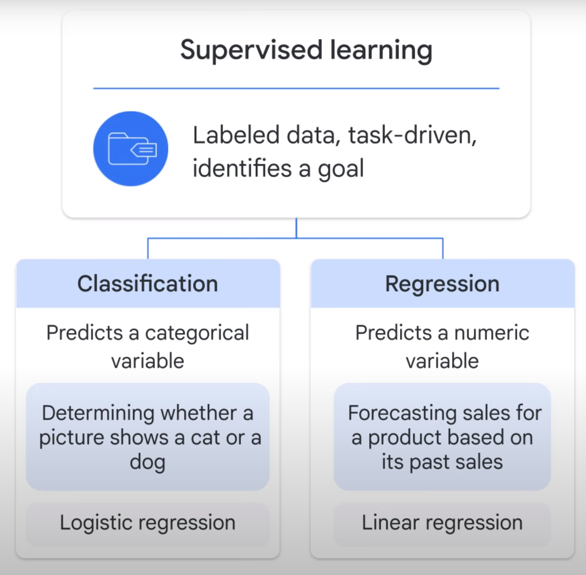

## ML model categories

## artificial intelligence vs machine learning
- **AI** : is an umbrella term that includes anything related to computers mimicking human intelligence. For example, robots and self-driving cars
- **ML** : is a subset of artificial intelligence (AI) that allows computers to learn without being explicitly programmed.This is in contrast to traditional programming, where the computer is told explicitly what to do
    - Machine learning mainly includes **supervised** and **unsupervised** learning
    - **Deep learning/(deep neural networks)** : subset of machine learning that adds layers in between input data and output results to make a machine learn at more depth

## supervised vs unsupervised learning
- Imagine two types of problems: 
    - In problem one you are asked to **classify** dogs and cats from a very large set of pictures.

        You already know the difference between dogs and cats.

        So you **label** each picture and pass the labeled pictures to a machine.

        By learning from the data, in this case, pictures, with the answers, or labels, supervised learning is being

        enacted, allowing the machine to tell if a new picture represents a dog or cat in the future.

    - In problem two you are asked to classify breeds of dogs.

        Unfortunately this time you don’t know many of them and are not able to label the pictures.
        So you send these unlabeled pictures to a machine
        In this case, the **machine learns from the data without the answers/lables** and finds underlying **patterns** to group the animals.
        This is an example of unsupervised learning

- Put simply
    - **Supervised learning** deals with labeled data, is task-driven, and identifies a **goal**. **Unsupervised learning**, however, deals with unlabeled data, is data-driven, and identifies a **pattern**.
    - An easy way to distinguish between the two is that supervised learning provides each data point with a label, or an answer, while unsupervised does not.

### two major types of supervised learning: 
- Classification, which predicts a categorical ***variable***, such as determining whether a picture shows a cat or a dog.
    - In ML, you use models like a **logistic regression model** to solve classification problems.

- Regression, which predicts a numeric variable, like forecasting sales for a product based on its past sales.
    - In ML, you use models like a **linear regression model** to solve regression problems.

### three major types of unsupervised learning:
- clustering, which groups together data points with similar characteristics and assigns them to "clusters," like using customer demographics to determine customer segmentation.
    - You use ML models like k-means clustering to solve clustering problems.

- association, which identifies underlying relationships, like a correlation between two products to place them closer together in a grocery store for a promotion.
    - You use association rule learning techniques and algorithms like Apriori to solve association problems.

- dimensionality reduction, which reduces the number of **dimensions**, or **features**, in a dataset to improve the *efficiency of a model*.
    - For example, combining customer characteristics like age, driving violation history, or car type, to create a simplified rule for calculating an insurance quote.
    - You use ML techniques like principal component analysis to solve these problems.

## Test examples 

### predict customer spending based on purchase history.
- **supervised learning** because you have the labeled data, the amount the customers have spent, and you want to predict their future purchases
- **regression** problem because it predicts a continuous number: future spending.
- **linear regression model** is for regression problems.

### Imagine you are using the same dataset; however, this time you are asked to identify customer segmentation.
- **unsupervised learning** because you don’t have each customer labeled as belonging to a certain segment. Instead, you want the computer to discover the underlying pattern
- **clustering** problem because identifying customer segmentation/*cluster*
- **k-means clustering model** it’s a clustering analysis scenario

## BigQuery ML
Building and training ML models can be very time-intensive
   - import and prepare 
   - experiment with different ML models and tune the parameters
   - train the model with new data and features To improve the model performance
   - deploy the model to make predictions

This is an iterative process that requires a lot of time and resources.

**BigQuery ML** tunes the parameters for you and helps you manage the ML workflow.

**phases of a machine learning project and the key SQL commands**

- In phase 1, you extract, transform, and load data into BigQuery, if it isn’t there already.

- In phase 2, you select and preprocess features. 
    You can use SQL to create the **training dataset** for the model to learn from. 
    BigQuery ML does some of the preprocessing for you, like one-hot encoding of your categorical variables.
    *One-hot encoding converts your categorical data into numeric data that is required by a training model.*

- In phase 3, you create the model inside BigQuery. This is done by using the 'CREATE MODEL' command.
    For exmaple, you want to create a ML model to predict customer purchasing behavior, specifically if they will buy this product in the future.
    - You give the model a name: ecommerce.classification.
    - You then specify the model type: model_type: logistic_reg

- BigQuery ML supports MLOps :
    - **MLOps** turns your ML experiment to production and helps deploy, monitor, and manage the ML models