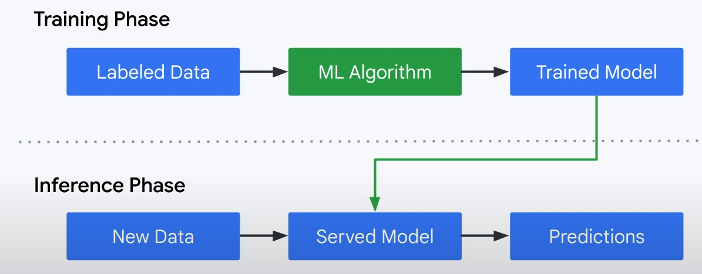
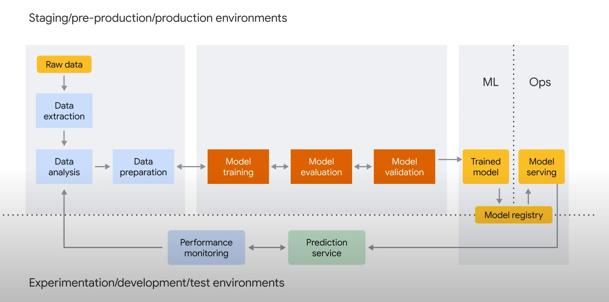
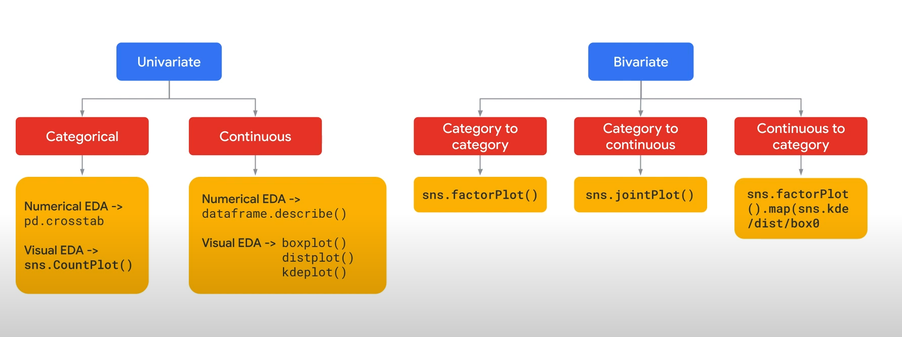
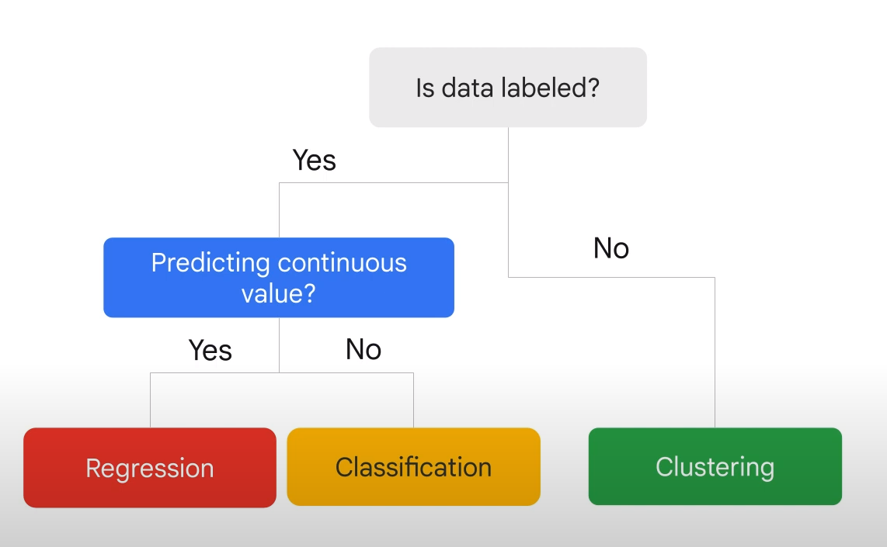
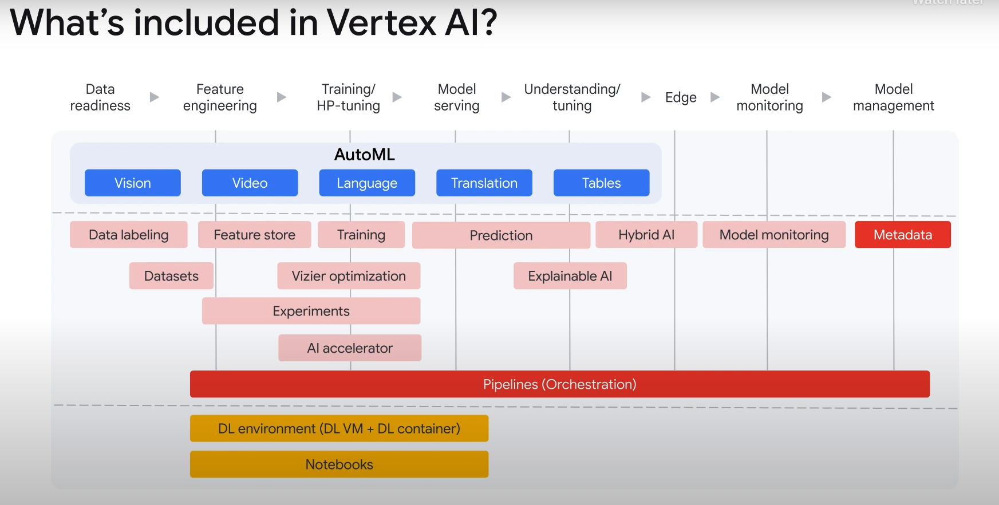

# Get to Know Your Data: Improve Data through Exploratory Data Analysis
## Intro
- exploratory data analysis
- missing values can skew our results
- categorize missing data strategies
- improve your data quality.

## Improve data quality
- ML phases :
     - training phase
     - an inference phase.




-  delivering an ML model to production involves the following steps :




- **Exploratory Data Analysis (EDA)** : involves using graphics and basic sample statistics to get a feeling for what information might 
    be obtainable from your dataset.

    - outliers or anomalies, trends, and data distributions, all while attempting to identify those features that can aid in increasing the predictive power of your machine-learning model.


- Most ML models require categorical data to be in numerical format. "one hot econding"

- data asset inventories "quality"
    - Accurate
    - Complete
    - Timely
    - Consistent


## What is exploratory data analysis?
is an approach to analyzing data sets to summarize their main characteristics, often with visual methods.
00:16
A statistical model can be used or not, but primarily EDA is for seeing what the data can tell us beyond the formal modeling or hypothesis testing task.

trends, outliers and patterns.

The three popular data analysis approaches are classical, exploratory data analysis and Bayesian


For exploratory data analysis, the focus is on the data, its structure, outliers and models suggested by the data.

exploratory data analysis is typically performed using the following methods.
00:49
Univariate analysis is the simplest form of analyzing data; "uni" means one, so in other words, your data has only one variable.


It doesn't deal with causes or relationships, unlike regression, and its major purpose is to describe.

It takes the data, it summarizes that data, and it finds patterns in the data.


It takes the data, it summarizes that data, and it finds patterns in the data.


Bivariate analysis means the analysis of bivariate data.
02:31
It is one of the simplest forms of statistical analysis, and is used to find out if there is a relationship between two sets of values.


It usually involves the variables X and Y





## Data analysis and visualization


## Machine Learning in Practice


# Machine Learning in Practice


supervised learning, which is one branch of machine learning where you give the model labeled examples.
we have labels or in other words, the correct answers to whatever it is that we to learn to predict.
Typically, this is something we know about in historical data but we don't know in real time.

We know other things which we call predictors, and we want to use those predictors to predict the thing we don't know.

For example, let's say you are the waiter in a restaurant.
01:38
You have historical data of the bill amount and how much different people tipped.
01:43
Now, you're looking at the group sitting at the corner table.
You know what their total bill is, but you don't know what their tip is going to be.
01:51
In historical data, the tip is a label.
You create a model to predict the tip from the bill amount, then you try to predict the tip in real time based on the historical data and the values that you know for the specific table.

Within supervised ML, there are two types of problems, regression, and classification.

tip dataset .. 

In machine learning, we call each row an example.

We'll choose one of the columns as the characteristic we want to predict called the label, and we'll choose a set of the other columns which are called the features.

In model option one, we want to predict the tip amount; therefore, the column tip is my label.

I can use one, all, or any number of columns as my features to predict the tip.
02:50
This will be a regression model because tip is a continuous label.


In model option two, we want to predict the sex of the customer; therefore, the column sex is the label.

This will be a classification model because our label sex has a discrete number of values or classes.


Your data isn't labeled, we won't be able to use supervised learning then and we'll have your resort to clustering algorithms to discover interesting properties of the data.

Your data is labeled and the label is dog breed, which is a discreet quantity since there are a finite number of dog breeds, we use a classification algorithm then.

If instead the label is dog weight, which is a continuous quantity, we should use a regression algorithm.
03:51
The label, again, is the thing that you are trying to predict.


In supervised learning, you have some data with the correct answers.




===
In unsupervised learning, the data does not have labels.
unsupervised problems are all about discovery, about looking at the raw data and seeing if it naturally falls into groups.


### Liner Regression
In regression problems, the goal is to use mathematical functions of different combinations of features to predict the continuous value of our label.

In regression problems we want to minimize the error between our predicted continuous value and the label's continuous value, usually using mean-squared error.


In classification problems, instead of trying to predict a continuous variable we are trying to create a decision boundary that separates the different classes.

In classification problems we want to minimize the error or misclassification between our predicted class and the labels class.
03:03
This is done usually using cross entropy.


A linear decision boundary will form a line or a hyperplane in higher dimensions with each class on either side.


Both of these problem types, regression and classification, can be thought of as prediction problems in contrast, to unsupervised problems, which are like description problems.

What is the most essential metric a regression model uses?
Mean squared error as their loss function


- note : Cross-entropy loss, or log loss, measures the performance of a **classification** model whose output is a probability value between 0 and 1

### Logistic regression
- transfor liner regression by a sigmoid activiation function

Why is regularization important in logistic regression?
Avoids overfitting.


# Traning AutoML Models using Vertex AI

## Training AutoML Models Using Vertex AI



- The vast majority of your data should be in the training set. This is the data your model sees during training.
- It's used to learn the parameters of the model, namely the ***weights of the connections between nodes of the neural network***.


- The validation set, sometimes called the "dev" set, is also used during the training process.
    - to tune the model's hyperparameters which are variables that specify the model's structure
    - it helps your model to generalize better.

- If you try to use the training set to tune the hyperparameters, it's quite likely the model will end up overly focused on your training data and ***have a hard time generalizing to examples that don't exactly match it***.


### - regression metrics :
    - Mean absolute error, MAE : 
        - is the average absolute difference between the target and predicted values.
        - It measures the average magnitude of the errors, the difference between a target and predicted value and a set of predictions.
        - When evaluating MAE, a smaller value indicates a higher-quality model, zero represents a perfect predictor.

    - Mean absolute percentage error, MAPE :
        - is the average absolute percentage difference between the labels and the predicted values.
        - This metric ranges between zero and infinity, a lower value indicates a higher-quality model.

    - Root mean square error, RMSE :
        - RMSE is the square root of the average square difference between the target and predicted values.
        - RMSE is more sensitive to outliers than MAE.
        - a smaller value indicates a higher-quality model, zero represents a perfect predictor.

    - root mean squared logarithmic error, RMSLE:
        - is similar to RMSE except that it uses the natural logarithm of the predicted and actual values plus one
        - RMSLE penalizes under-prediction more heavily than over-prediction.
        - This metric ranges from zero to infinity, a lower value indicates a higher-quality model.
    - R2

    - Features Importance
        - how much each feature impacts a model.


### - classification metrics
    - Precison Recall Area Under the Curve, PR AUC :
        - This value ranges from zero to one, where a higher value indicates a higher-quality model.

    - ROC AUC, this is the area under the receiver operating characteristic ROC curve.
        - This ranges from zero to one, where a higher value indicates a higher-quality model.

    - Log loss, this is the cross-entropy between the model predictions and the target values.
        - This ranges from zero to infinity, where a lower value indicates a higher-quality model.

    - F1 score, this is the harmonic mean of precision and recall.
        - F1 is a useful metric if you're looking for a balance between precision and recall and there's an uneven class distribution.

    - Precision and recall are classification-evaluation metrics and help you understand how well your model is capturing information and what it's leaving out.

    - Precision :
        - is the fraction of the positive predictions that were correct; of all the predictions of a customer purchase, what fraction were actual purchases.

    - Recall :
        - is the fraction of rows with this label that the model correctly predicted; of all the customer purchases that could have been identified, what fraction were.

- A confusion matrix assesses the accuracy of a predictive model.
    - It is used with classification models, meaning the response value is categorical thus the model predicts one response value for

Which of the following metrics can be used to find a suitable balance between precision and recall in a model?
F1 score


# BigQuery Machine Learning: Develop ML Models Where Your Data Lives

```sql
#standardSQL
CREATE OR REPLACE MODEL `bqml_tutorial.penguins_model`
OPTIONS
  (model_type='linear_reg',
  input_label_cols=['body_mass_g']) AS
SELECT
  *
FROM
  `bigquery-public-data.ml_datasets.penguins`
WHERE
  body_mass_g IS NOT NULL
```

```sql
#standardSQL
SELECT
  *
FROM
  ML.EVALUATE(MODEL `bqml_tutorial.penguins_model`,
    (
    SELECT
      *
    FROM
      `bigquery-public-data.ml_datasets.penguins`
    WHERE
      body_mass_g IS NOT NULL))
```

```sql
#standardSQL
SELECT
  *
FROM
  ML.EVALUATE(MODEL `bqml_tutorial.penguins_model`)
```

```sql
#standardSQL
SELECT
  *
FROM
  ML.PREDICT(MODEL `bqml_tutorial.penguins_model`,
    (
    SELECT
      *
    FROM
      `bigquery-public-data.ml_datasets.penguins`
    WHERE
      body_mass_g IS NOT NULL
      AND island = "Biscoe"))
```

```sql
#standardSQL
SELECT
  *
FROM
  ML.EXPLAIN_PREDICT(MODEL `bqml_tutorial.penguins_model`,
    (
    SELECT
      *
    FROM
      `bigquery-public-data.ml_datasets.penguins`
    WHERE
      body_mass_g IS NOT NULL
      AND island = "Biscoe"),
    STRUCT(3 as top_k_features))
```


## BigQuery ML hyperparameter tuning
- hyperparameter tuning identifies a set of optimal hyperparameters for a learning algorithm.

- **hyperparameter** is a model argument whose value is set before the learning process begins.
- By contrast, the values of other parameters, such as coefficients of a linear model, are learned.

- Hyperparameter tuning is commonly used to improve model performance by searching for the optimal hyperparameters.

- ROC AUC is an evaluation metric for binary classification problems. It is a probability curve that plots the TPR against the FPR at various threshold values and essentially separates the signal from the noise. The area under the curve, or AUC, is the measure of the ability of a classifier to distinguish between classes and is used as a summary of the ROC curve.


For Classification or Regression problems with decision trees, which of the following models is most relevant?
XGBoost

Which of these BigQuery supported classification models is most relevant for predicting binary results, such as True/False?
DNN Classifier (TensorFlow)


Where labels are not available, for example where customer segmentation is required, which of the following BigQuery supported models is useful?

K-Means Clustering

