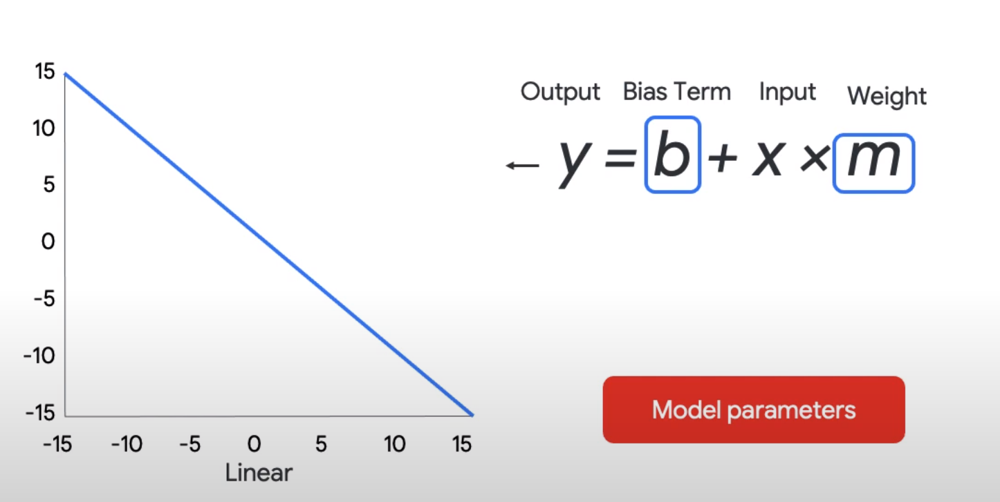
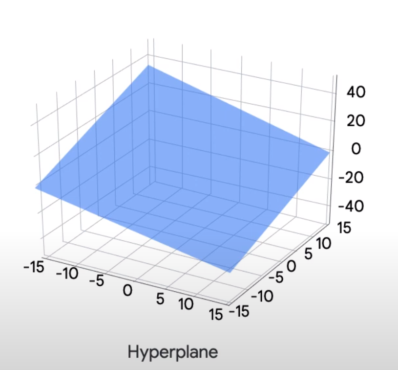
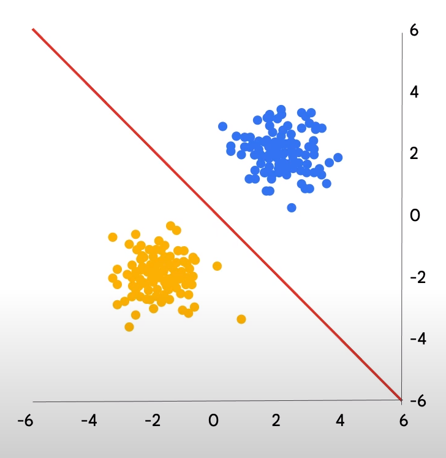

# Defining ML Modele

- optimization always requires a standard by which to say we're improving, we'll discuss loss functions

- ML models are mathematical functions with :
    - **parameters** and **hyperparameters**

    - *parameter* : is a real valued variable that changes during model training
    - *hyperparameter*: is a setting that we set before training and which doesn't change afterwards

- **linear models** were one of the first sorts of ML models 
    - In a linear model, small changes in the *independent variables*, or ***features*** as we refer to them in *machine learning*, yield the same amount of change in the *dependent* variable or label regardless of where that change takes place in the input space.

    

    - ***Explain** :
        - formula used to model the relationship is simply : *image*
            - **M** captures the amount of *change* we observe in our **label** in response to a small change in our **feature**.

    - This same concept of a relationship defined by a fixed ratio change between labels and features can be extended to arbitrarily hide dimensionality, 
    
        both with respect to the inputs and the outputs, meaning ***we can build models that accept many more features as input, model multiple labels simultaneously or both***.
        - When we increase the *dimensionality* of the input, our slope term M must become *n-dimensional*. We call this new term the **weight**.
        - Visually this process yields the n-dimensional *generalization of a line*, which is called a **hyperplane**
        
            - when we increase the dimensionality of the outputs, our Y and C terms must become vectors of dimensionality and two.
            - The B term, whether as a scalar or a vector is referred to as the **bias** term.

    - How a linear model can be used for regression ?
        - b (bias) + m (weight) * x (input) = y (output)

    - but how can a linear model be used for **classification?**
        - In order to take our model's numerical output and turn it into a *class*, we need to first think about how *class membership can be encoded*
            - The simplest way to encode class membership is with a binary. Either you're a member or you're not.
            - we need a way to map our line onto a binary classification rule. One easy way to do this is to simply rely on the *side of the output*.
            - Graphically that looks like dividing our graph into two regions, the points above the line and the points below it.
            - we call that line **decision boundary**
                - It's intended to be predictive of unseen data.
                    - This property of extending to unseen examples is called **generalization**, and it's essential to ML models.

            

# Introducing the course dataset

TBE

# Introduction to loss functions
- analytical methods for finding the best set of model parameters don't scale.
- think of optimizing our parameters as **searching through parameter space**, but to compare one point to another, we'll need some sort of *measure* (loss function).

TBE

# Gradient descent